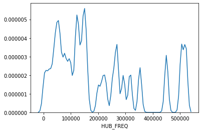

# Winning Solution to Turkish Airlines Travel Datathon 2019

The main case of the datathon was an estimation of the number of future reservations (PSGR_COUNT: Passengers Count) based on the historical reservation data of all airlines around the world, consisting of 90 million observations.

This is the brief summary of our winning solution with the code for each step. Please visit the official datathon blog post for more details; 
https://medium.com/@digitalinnovationthy/travel-datathon-2019-2a6b14cdcd7c

Performance Metric: Root Mean Square Error (RMSE).

1- Exploratory Data Analysis and Preprocessing
When we examined the data we have, we applied certain methods in order to move faster since there are 90,562,838 rows of data. We converted the numerical variables that take up memory space from 64-bit to 32-bit to make the data take up less space. At the same time, we have saved more than 60% memory by converting "object" type variables to "category" type. In this way, we had the opportunity to test things faster.

We saved 50% time by distributing the functions we wrote to different cores on the CPU in order to manipulate the data faster. On top of that, in order to test new variables and methods, we performed our tests on 9,056,283 rows of data by taking a sample of 10% of the total data with an even distribution of dates. We gradually improved our models by applying the methods and new variables that were successful in our tests to all data. We can understand that this method is consistent from the fact that the sample we took and the date distribution of all data are similar as seen in the graphic below.

2- Feature Engineering
First, we obtained a model with an RMSE score of 2.628596 by applying the Lightgbm algorithm only over the given raw variables, and then we established our final model by testing different variables. The variables we use in our last model;

● Variables in raw data,
● Day, Month, Year, Hour, Week variables
● Leg1 Flight time, Leg2 flight time and total travel time
● Carrier, Origin, Hub and Destination based aggregation
● Time elapsed from the last flight based on Carrier, Origin, Hub and Destination and the time remaining to the next flight (Recency Features)
● Target encoding and frequency encoding variables over categorical variables such as Carrier, Origin, Hub and Destination (We will explain in detail below)

Approximately 60% of the data consists of categorical variables with too many levers. When tree-based algorithms such as Lightgbm we use work on these types of variables, there is a risk of overfitting, so the target encoding method has been applied by applying the article with the reference below in order to digitize these non-numeric variables. The difference of this method from using the average number of passengers of each variable instead of the variable is to reduce the possibility of overfitting by multiplying it by the smoothing coefficient as in the method described below.

As can be seen in the graph below, the average passenger numbers of the values in the "HUB" variable are shown in blue. When these values are used directly, our model has the risk of overlooking different situations as it focuses entirely on the available data. Therefore, by using the method in the article, we obtain the values shown in orange with the smoothing way and include them in our model.

The frequency encoding method was also used in the model as in the formula below to include how much the values in each categorical variable are repeated in the data.

Our tests were applied on all data and the RMSE value of 2.4135 was obtained. You can see the most important variables of the latest model below.

Thanks,

Emin

